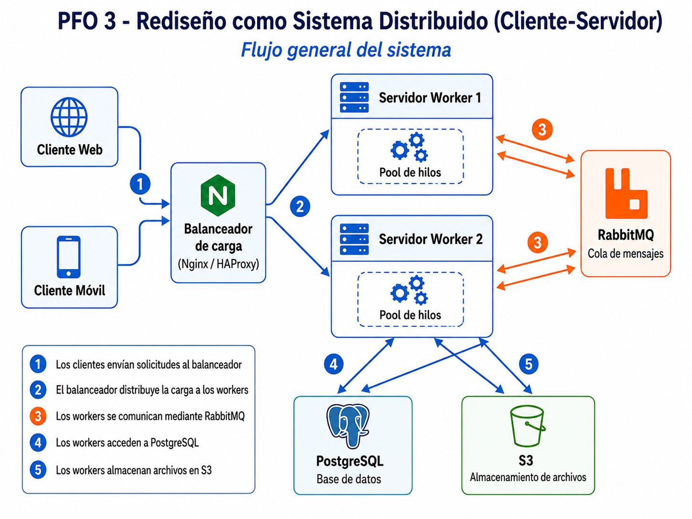

# PFO 3 - Rediseño como Sistema Distribuido (Cliente-Servidor)

Este proyecto toma como base el PFO 2, que era un sistema de gestión de tareas con registro, login, sesiones simples y SQLite.

Para esta entrega se cambia la comunicación HTTP/Flask por una comunicación cliente-servidor usando sockets TCP. Además, el servidor recibe las solicitudes, las coloca en una cola interna y las distribuye a workers ejecutados con hilos.

## Diagrama del sistema



El diagrama incluye la arquitectura completa solicitada: clientes web/móviles, balanceador de carga, servidores workers con pool de hilos, RabbitMQ, PostgreSQL y S3.

En el código no se implementan RabbitMQ, PostgreSQL, S3 ni el balanceador de carga como servicios reales. Esos componentes quedan representados en el diagrama de arquitectura. La implementación en Python se concentra en el cliente, el servidor por sockets, la cola interna y los workers.

## Cosas que se mantienen de la versión anterior (PFO 2)

Se conserva la lógica principal de:

- Registro de usuario.
- Inicio de sesión.
- Cierre de sesión.
- Sesión simple asociada a la IP del cliente.
- Contraseñas hasheadas.
- Base de datos SQLite para guardar usuarios.
- Listado simple de tareas.
- Cliente de consola con menú.

## Cambios de la nueva versión (PFO 3):

El cambio principal es la forma de comunicación:

```text
Antes:
Cliente -> HTTP / Flask -> Servidor -> SQLite

Ahora:
Cliente -> Socket TCP -> Servidor -> Cola interna -> Workers -> SQLite
```

Agrego logs para visualizar el recorrido de cada solicitud.

## Archivos del proyecto

- `servidor.py`: servidor que recibe solicitudes por socket, las coloca en una cola interna y las manda a los workers.
- `cliente.py`: cliente de consola que envía solicitudes al servidor y muestra la respuesta.
- `diagrama_sistema_distribuido.png`: diagrama de arquitectura.
- `requirements.txt`: dependencia necesaria para el hasheo de contraseñas.

## Instalación

Instalar las dependencias:

```bash
pip install -r requirements.txt
```

## Ejecución

Primero ejecutar el servidor:

```bash
python servidor.py
```

Luego, en otra terminal, ejecutar el cliente:

```bash
python cliente.py
```

## Opciones del cliente

El cliente mantiene un menú similar al de la versión anterior:

1. Registrar usuario.
2. Iniciar sesión.
3. Ver página de tareas.
4. Salir.

Cada opción se envía al servidor como un mensaje JSON por socket TCP.

## Simulación del recorrido mediante logs

El servidor muestra logs para ver por dónde pasa cada solicitud:

```text
[12:00:01] [CLIENTE] Conexión recibida desde 127.0.0.1:53000 | Solicitud #1
[12:00:01] [SOCKET] Solicitud #1 recibida
[12:00:01] [COLA] Solicitud #1 enviada a la cola interna
[12:00:01] [WORKER 1] Tomó la solicitud #1 desde la cola
[12:00:01] [WORKER 1] Procesando acción 'login' de la solicitud #1
[12:00:02] [WORKER 1] Finalizó la solicitud #1
[12:00:02] [RESPUESTA] Enviando respuesta de la solicitud #1 al cliente
```

El cliente también muestra el recorrido recibido desde el servidor:

```text
1. El cliente envió la solicitud por socket TCP
2. El servidor recibió la solicitud
3. El servidor colocó la solicitud en la cola interna
4. Un worker tomó la solicitud y la procesó
5. El servidor envió la respuesta al cliente
```

Esto permite comprobar el flujo cliente-servidor y ayuda a detectar errores si algo falla.
